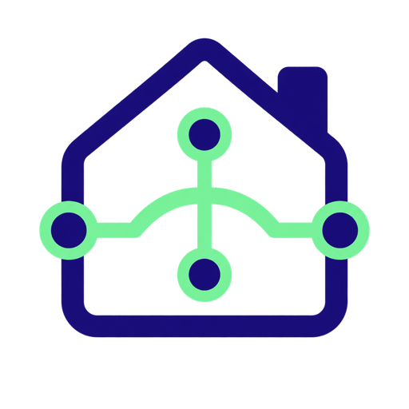

<p align="center">
  
</p>

<h1 align="center">EFAPEL Domus40 for Home Assistant</h1>

<p align="center">
  <a href="https://github.com/fiam/home-assistant-domus40/actions/workflows/check.yml"></a>
  
  <a href="LICENSE"></a>
</p>

> [!IMPORTANT]
> This is an unofficial interoperability project. It is not affiliated with,
> endorsed by, or supported by EFAPEL. EFAPEL and Domus40 are names belonging
> to their respective owner and are used only to identify compatible systems.

This custom integration connects Home Assistant directly to an EFAPEL
Domus40 **Home Server D40 (reference 40930)** on the local network. The
integration does not connect to or require EFAPEL/Domus40 cloud services. It
uses private, unsupported Home Server interfaces that may change with a Home
Server update.

The Home Server is required: this integration cannot communicate directly
with individual Domus40 modules. See EFAPEL's official resources for the
hardware and its installation:

- [Home Server product page](https://www.efapel.pt/produtos/domotica/home-server-40930)
- [Domus40 technical manual](https://efapel.pt/links/stable/manuaistecnicos/efapel-manual-tecnico-domus40-pt.pdf)
- [Domus40 quick installation manual](https://www.efapel.pt/media/Manual-de-Instalacao-Rapida-Domus40-6597c3f7baa1c.pdf)
- [EFAPEL technical documents](https://www.efapel.pt/documentos-tecnicos)

## Requirements

- Home Assistant `2026.8.3` or the version listed in
  [the compatibility contract](COMPATIBILITY.md)
- An EFAPEL Domus40 Home Server reachable from the Home Assistant host
- An existing administrator account accepted by that Home Server

Home Assistant stores the supplied credentials in its normal config entry.
The integration sends them only to the configured Home Server and excludes
credentials, addresses, device names, and identifiers from diagnostics.

## Installation

### HACS custom repository

1. Open **HACS → Integrations**.
2. Open the menu and select **Custom repositories**.
3. Add `https://github.com/fiam/home-assistant-domus40` with category
   **Integration**.
4. Find **EFAPEL Domus40**, select **Download**, and restart Home Assistant.

### Manual installation

1. Copy `custom_components/domus40` from this repository to
   `/config/custom_components/domus40` in Home Assistant.
2. Restart Home Assistant.

## Configuration

Open **Settings → Devices & services → Add integration**, search for **EFAPEL
Domus40**, and follow the setup flow.

Home Assistant normally discovers the Home Server using SSDP. If multicast
discovery is unavailable across the network, enter the Home Server's LAN IP
address or resolvable hostname manually. Then enter an existing Home Server
administrator username and password. A cloud account is neither requested nor
used.

The setup flow, options, and integration actions are translated into English,
Portuguese, and Spanish.

## Supported devices and entities

| Domus40 capability or type | Home Assistant entity |
| --- | --- |
| `LightingRegulator` | Dimmable `light` |
| `OnOffCommuter`, `OnOffCommuter2` | `light` |
| `BlindsControl` | Position-aware `cover` |
| `Plug`, `PlugSocket`, `PlugWall` | `switch` |
| Four-button emitter, including `QuadPressureButton` | Four `event` entities, Key A–D |
| Multifunction IR receiver | Sixteen disabled-by-default `event` entities |
| Logical row with `capMetering` | Instantaneous `sensor` in watts |

The Home Server lists controllable outputs as **Actuators** and input devices
as **Switches**; the Portuguese interface calls inputs **Emissores**. The
integration keeps separately named logical channels and emitters as separate
Home Assistant devices, linking physical siblings with `via_device` where
applicable.

### Floors and areas

Domus40's two location levels map to Home Assistant's native hierarchy:
Domus40 **Área** becomes a Home Assistant **Floor**, and Domus40 **Divisão**
becomes a Home Assistant **Area**. Division names remain unchanged when unique.
Only duplicate division names are qualified with their parent, for example
`Floor A · Shared room`, because Home Assistant area names are globally unique.

Existing custom Home Assistant device-area assignments and non-empty
area-floor assignments are preserved. After changing locations in Domus40,
select **Refresh inventory and mappings** on the integration entry.

### Wall and IR events

Each wall-key entity includes the Home Server's current assignment in its
visible name and exposes structured `hub_mapping` and `hub_actions` attributes
under **Developer Tools → States**. The integration observes button events; it
does not replay mapped actions because the Home Server already executes them.

Wall mappings load in the background. IR entities are disabled by default and
their mappings load only after they are enabled. Use **Refresh inventory and
mappings** after editing assignments or inventory in the Domus40 interface.

### Identification

Lights and blinds expose two identification actions:

- **Identify actuator — _name_** identifies the selected actuator.
- **Identify associated switches — _name_** identifies every currently mapped
  emitter that targets that actuator.

Each emitter exposes **Identify switch**, which identifies that emitter only.
The duration defaults to 30 seconds and can be changed from 1 to 30 seconds
under **Settings → Devices & services → EFAPEL Domus40 → Configure**.

### Power measurements

Every metering-capable logical row exposes an instantaneous power sensor in
watts. The integration acquires short reporting leases in bounded round-robin
batches to avoid overloading the Home Server. It does not expose the private
history values as lifetime energy because they have not been verified as a
monotonic total. A Home Assistant Integration helper can derive kWh from the
power sensor when needed.

## Troubleshooting

- If discovery does not appear, verify that Home Assistant and the Home Server
  can exchange SSDP multicast traffic, or use the manual LAN address flow.
- If devices or mappings were changed in Domus40, use **Refresh inventory and
  mappings**.
- If push updates stop after a Home Server update, download diagnostics and
  inspect `schema_compatible`. A schema mismatch safely falls back to periodic
  REST refreshes instead of guessing at protobuf values.
- **Monitor unknown MQTT messages** can be enabled temporarily in the Configure
  dialog. It records only bounded, redacted topic shapes and protobuf field/wire
  signatures. Disable it after collecting diagnostics.

The integration polls authoritative state every 30 seconds and supplements it
with local MQTT-over-WebSocket events. Commands update Home Assistant
optimistically while the integration reconciles a temporarily stale REST view.
No distinct blind stop command has been verified, so one is not advertised.

## Protocol and development

The private LAN protocol, endpoint behavior, transport, decoding rules, and
complete supported protobuf contract are documented in
[docs/protocol.md](docs/protocol.md). The protocol was reverse engineered by
monitoring traffic exchanged with the Home Server on a controlled local
network and was reproduced using synthetic fixtures.

Run the complete contract suite with:

```sh
task check
```

The emulator under [`domus40_emulator/`](domus40_emulator/) uses only synthetic
credentials, inventory, identifiers, and events.

## Project policies

- [Compatibility contract](COMPATIBILITY.md)
- [Contributing](CONTRIBUTING.md)
- [Security policy](SECURITY.md)
- [Changelog](CHANGELOG.md)
- [Artwork provenance](assets/README.md)
- [MIT license](LICENSE)
